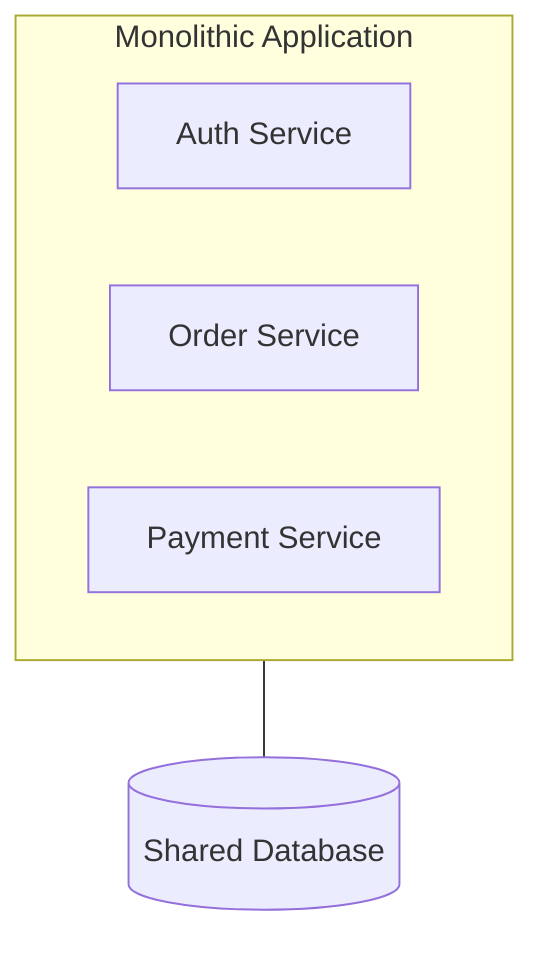
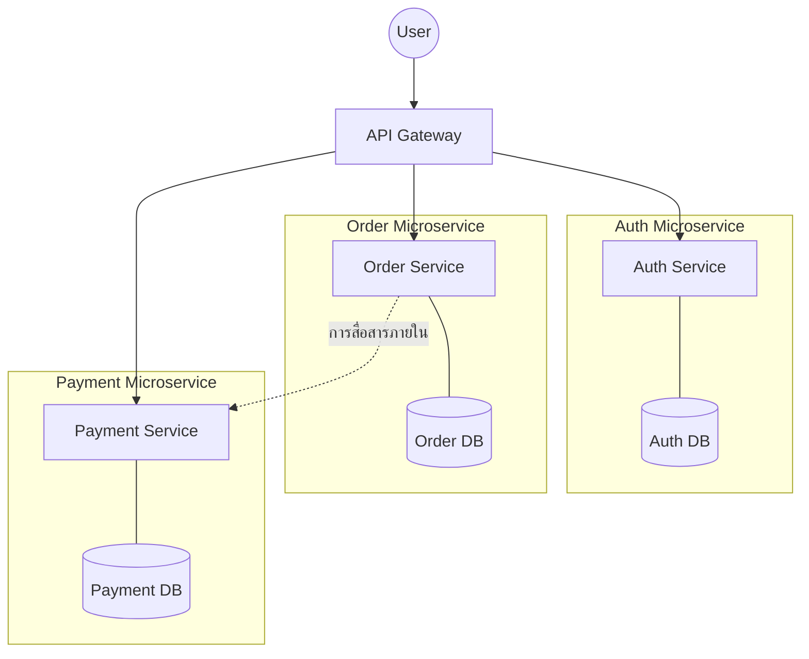

# Monolith vs Microservice
## Monolith

Monolith คือ Software pattern ที่รวมบริการทุกอย่างไว้ในที่ Repository เดียวกัน

### ลักษณะ
- ในระบบนี้จะใช้ 1 Database เท่านั้น ทุกๆ บริการจะอยู่ใน Database ตัวนี้
- บริการทุกอันอยู่ใน Repository เดียวกัน
- หลายๆ บริการสามารถอยู่ใน Transaction เดียวกันได้ เนื่องจากยังไงก็มีแค่ 1 Database

### ข้อดี
- จัดการ Transaction ง่ายเนื่องจากมีแค่ 1 Database (ACID)
- Deploy ง่ายแค่เพราะมีแค่ก้อนๆ เดียว
- Develop ง่ายๆ กว่าในช่วงแรกๆ ที่ระบบไม่ใหญ่มาก

### ข้อเสีย
- Maintenance ยากหากระบบใหญ่ขึ้นมาก ใช้เวลานานในการเพิ่ม หรือแก้ไข
- การ Testing ทำได้ยากตอนที่ระบบใหญ่และใช้เวลานานมาก
- ต้องบังคับใช้ Tech stack เดียวกันทั้งระบบ
  - ในขณะที่ Microservice สามารถแยก Tech stack ตามแต่ละบริการ

## Microservice

คือ Software pattern ที่เขียนระบบเป็นบริการแยกๆ กันเป็น Service ที่มีหน้าที่เฉพาะของตนและเป็นอิสระต่อกันโดยสิ้นเชิง

### ลักษณะ
- แต่ละ Service มี Database เป็นของตนเองและแยกกับ Service อื่นๆ
- แต่ละ Service มี Transaction แยกกัน เพราะอยู่กันคนละ Database
- ต้องมีการสื่อสารภายในระหว่าง Services
- แต่ละ Service มี Tech stack เป็นของต้นเองได้
- แต่ละ Service แยกกัน Deployment ได้อิสระ

### ข้อดี
- พอระบบใหญ่ๆ จะ Maintenance ได้ง่ายกว่า Monolith มากๆ
- Service เป็นอิสระต่อกันทำให้
  - แยกกันพัฒนาได้โดยแบ่งเป็นทีมเล็ก
  - แต่ละ Service เลือกใช้ Tech stack เป็นของตนเองได้
  - แยกกันได้ Deploy ตามแต่ละ Service
- ทดสอบง่ายเนื่องจากแยก Service ออกมาเป็นเล็กๆ ทำให้
  - ทดสอบได้เร็วและใช้เวลาน้อยกว่า Monolith
  - ทดสอบได้ง่ายกว่า Monolith 

> Microservice ไม่ใช่ยาวิเศษรักษาทุกโรค
> 
> ใช่ว่าจะดีกว่า Monolith เสมอไป!

### ข้อเสีย
- ถ้าระบบไม่ใหญ่(ระบบเล็กๆ) Monolith จะดีกว่า
- จัดการ Transaction ยากกว่า เพราะมีหลายๆ Databases (เดี๋ยวเรียนรู้ใน SAGA Pattern)


