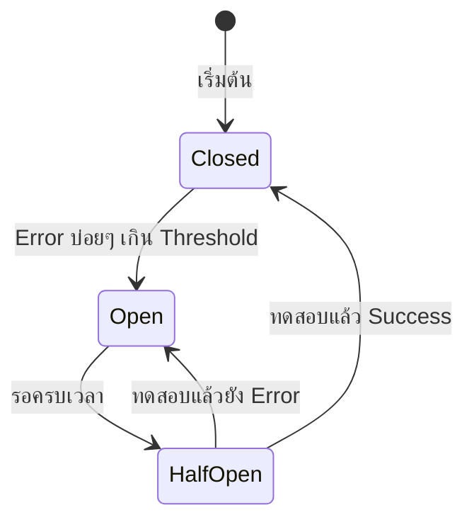
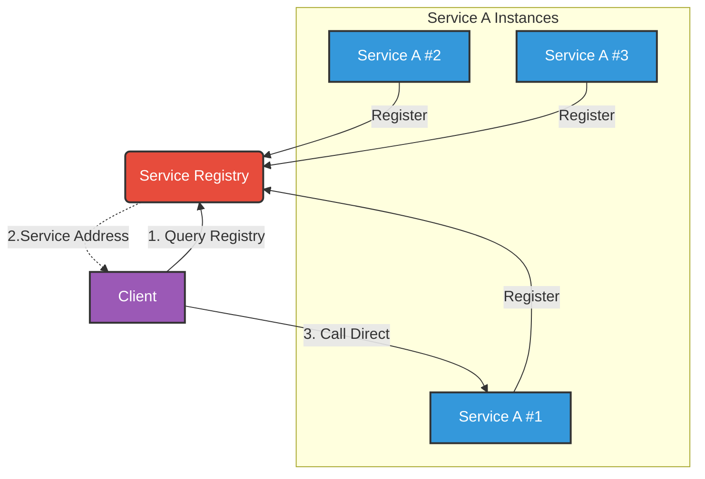
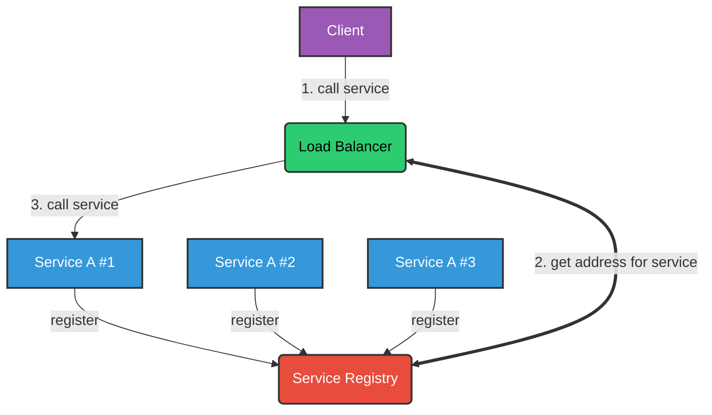
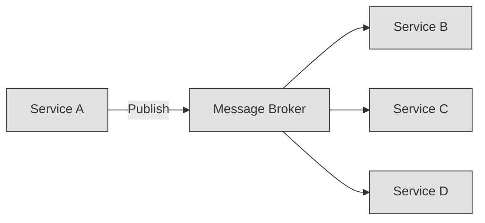
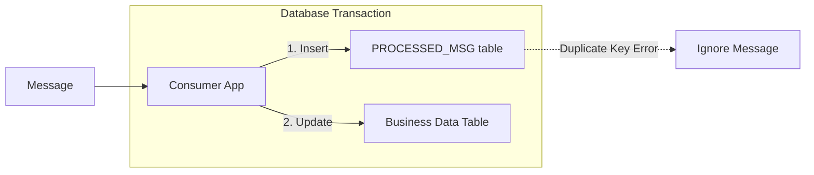
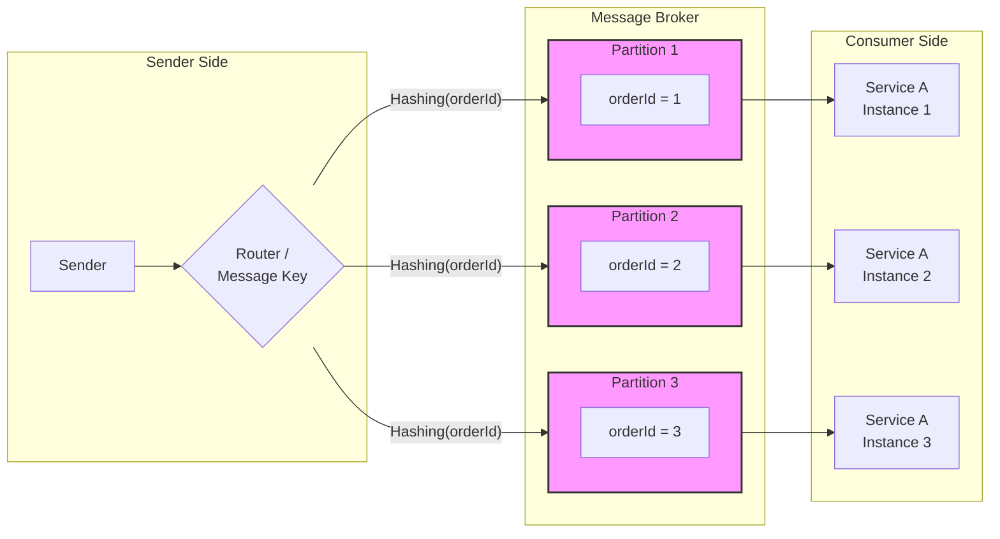
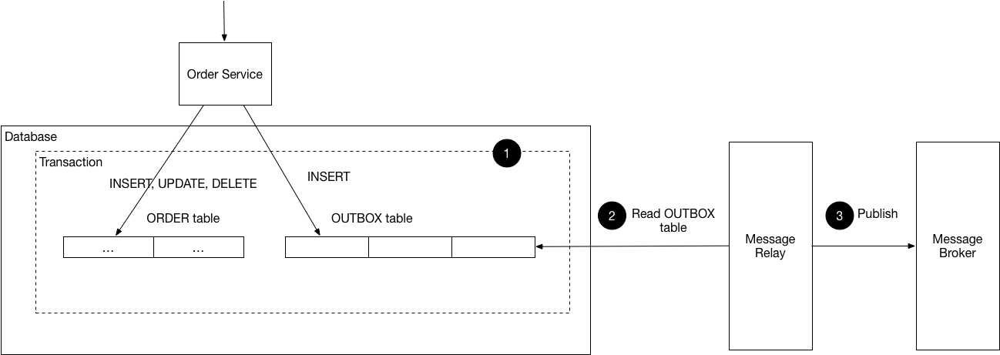

# Inter process communication (การสื่อสารภายใน)

> การสื่อสารระหว่าง Service นั้นเป็นหนึ่งในหัวใจหลักของ Microservice ทำให้เกิดการแลกเปลี่ยนข้อมูลซึ่งกันและกัน

## ชนิดของ Inter process communication

แบ่งออกเป็น 2 ชนิดได้แก่

1. Synchronous remote procedure invocation
   - ตัวอย่างเช่น gRPC, REST เป็นต้น
   - Circuit breaker pattern
2. Asynchronous messaging 
   - ตัวอย่างเช่น Kafka, RabbitMQ เป็นต้น
   - Message Broker pattern
   - Outbox Pattern

## Synchronous remote procedure invocation

> **Important Note** 📝:
>
> - รอการตอบสนอง (Blocking)
> - Circuit breaker pattern

### ลักษณะ
- Blocking เมื่อ Client ทำการ Request ไปหา Server และจะถูก Block (ต้องรอ) จนกว่า Server
- one-to-one สื่อสารได้แค่ 1 คู่เท่านั้น

### ข้อดี
- ไม่มีปัญหาจู้จี้จุกจิกเหมือน Asynchronous messaging
- เหมาะสมงานที่ต้องการคำตอบทันที (Realtime) หรือความถูกต้องสูง

### ข้อเสีย
- **High Coupling** หากมี Service ไหนตายไป ตายทั้งระบบ (Cascading Failure) เพราะรอการ Response จาก Service ที่ตายไปนั้นเอง ซึ่งจะไม่มีการตอบกลับมา
- สื่อสารได้แค่ one-to-one คุยเป็นคู่ๆ เท่านั้น

### ประเด็นสำคัญ
- **gRPC ประหยัด Bandwidth** มากกว่า REST
- ต้องมีการกำหนด **Timeout** ของการ Request
  - เพื่อป้องกัน Server ปลายทางตายแล้วต้นทางยังรอคนตาย
- **Circuit breaker pattern**
  - เพื่อป้องกัน Server ปลายทางตายแล้วต้นทางยังไปถามเรื่อยๆ
  - Circuit breaker เปรียบเสมือนสะพานไฟ ไว้กันไฟฟ้าลัดวงจร (Short Circuit) ถ้าในบริบทนี้หมายถึงป้องกันปลายทางตาย
- ถ้า Service มีหลายๆ Instance ต้องทำ Service Discovery
  - Client-Side Discovery
  - Server-Side Discovery

#### Circuit breaker pattern
เรามาลองดูว่ามีเรื่องอะไรที่ต้องรู้เกี่ยวกับ **Circuit breaker pattern** 
- มี Library จัดการเรื่องพวกนี้ให้
  - เช่นใน golang มี [hystrix-go](https://pkg.go.dev/github.com/afex/hystrix-go/hystrix) เป็นต้น

- `Closed` สถานะวงจรปิด ทำให้ Request เกิดตามปกติไปหาปลายทาง
  - หาก Error เกิดบ่อยเกินไปจะพาไปสู่สถานะ `Open`
- `Open` สถานะวงจรเปิด สั่งปิดการ Request ไปหาปลายทาง
  - รอเวลาสักพักเพื่อไปสู่สถานะ `HalfOpen`
- `HalfOpen` ที่สถานะนี้จะเกิดได้ 2 กรณี
  - ไปสู่ `Closed` เมื่อทดสอบแล้ว Success
  - ไปสู่ `Open` เมื่อทดสอบแล้วยัง Error

#### Service Discovery
เมื่อเราอยาก Scale โดยการขยายจำนวน Instance ของ Service เช่น เปิด Service A 5 ตัว เมื่อนั้นให้รู้ไว้ว่าเราต้องทำสองกรณีนี้เสมอคือ
##### 1. Client-Side Discovery
- Service Registry เทคโนโลยีและเครื่องมือสำคัญที่นิยมใช้ เช่น Netflix Eureka, HashiCorp Consul
- Client-Side Load Balancer & Client Libraries เทคโนโลยีและเครื่องมือสำคัญที่นิยมใช้ เช่น Spring Cloud LoadBalancer, OpenFeign

   - แต่ละ Instance ของ Service ต้อง register เข้า **Service registry**
   - Client ต้องเป็นคนถามไปหา Server ว่ามีบริการอยู่ไหนบ้างเอง?
   - Client ต้องเลือก Instance ที่จะไปเอง (Direct call) 
     - Client ต้องทำ **Client-Side Load Balancing** ด้วยตัวเอง เพื่อให้เลือกได้อย่างเหมาะสมที่สุด

##### 2. Server-Side Discovery

   - แต่ละ Instance ของ Service ต้อง register เข้า **Service registry**
   - Client ติดต่อกับ **Load balancer** ของ Server
   - **Load balancer** จะเป็นผู้เลือก Instance ให้ Client

> **Important Note** 📝:
>
> - Client-Side Discovery เลือกเอง
> - Server-Side Discovery ให้ Server เลือกให้

## Asynchronous messaging 

> **Important Note** 📝:
>
> - ไม่รอการตอบสนอง (Non-blocking)
> - Message broker Pattern
> - Outbox Pattern

### ลักษณะ 
- Non-blocking เมื่อ Client ทำการ Request ไม่ต้องรอ Response
- สื่อสารแบบ one-to-one คุยเป็นคู่หรือ one-to-many คุยเป็นกลุ่มก็ได้
- มีรูปแบบวิธีการสื่อสาร 2 รูปแบบ
  - Direct message (การสื่อสารตรง) 👎
    - Service รู้จักกันตรงๆ
    - ข้อเสีย คือ High Coupling ไม่ต่างจากแบบ Synchronous remote procedure invocation เช่น Service A คุยกับ Service B หากรู้จักกันตรงๆ จะพึ่งพากันมาเกินไป หาก Service B ตายจะส่งข้อมูลไม่ได้
  - Message broker (การสื่อสารผ่านคนกลาง) 👍
    - Service ไม่ได้รู้จักกันตรงๆ รู้จักแค่ Broker คนกลาง
    - ข้อดี คือ Loose coupling อิสระต่อกัน ไม่พึ่งพากัน

> Message broker เป็นตัวเลือกที่ดีที่สุด

#### Message Broker

เป็นดั่งไปรษณีย์ส่งจดหมายไปยัง Service ต่างๆ

### ข้อดี
- Loose coupling แทบไม่ต้องพึ่งพากันเลย
- Availability สูงกว่า เพราะหาก Service อื่นๆ ตายจะไม่พาเราตายไปด้วย
- สื่อสารได้มากกว่า 1 คู่

### ข้อเสีย
- ปัญหาจู้จี้จุกจิกเยอะกว่า Synchronous remote procedure invocation 

### ปัญหา
- Duplicated message บางครั้งอาจจะเกิดข้อความซ้ำส่งไป (รับมือได้ ✅)
- Incorrect Message Ordering บางครั้ง Message อาจจะผิดลำดับ (แก้ได้ ✅)

> ตัวอย่างเช่น Service A มี Instance คือ S1, S2 และมี Message คือ M1, M2 หากว่าการส่ง Message กระจายตัวเป็นดังนี้
>    - M1 ไปหา S1
>    -  M2 ไปหา S2
> 
> มีความเป็นไปได้ที่ M2 จะไปถึงปลายทางก่อน M1 ทำให้การ Process ผิดลำดับไป

- การ Update Database และการส่ง Message **ไม่** Atomicity ทำให้เกิดเหตุการดังนี้ (แก้ได้ ✅)
  - **ส่งแต่ไม่ Update** คือการ Update ดันได้ Error และ Rollback ไปแล้ว แต่ยังส่ง Message ไปบอกแล้วว่า Update สำเร็วแล้ว (ทั้งๆ ที่การ Update นั้นถูกยกเลิกไปแล้ว)
  - **Update แต่ไม่ส่ง** คือการ Update สำเร็จ แต่ส่ง Message **ไม่สำเร็จ** อันนี้ปลายทางก็จะไม่รู้ว่า Update แล้ว

### การแก้ปัญหา
#### การแก้ปัญหา Duplicated message
เราสามารถแก้ปัญหา Duplicated message ข้อความซ้ำได้โดยการบันทึก `Message ID` ของข้อความที่รับมาลง Database เพื่อให้ระบบรู้ว่าข้อความนี้เคยทำแล้วหรอไม่ ในกรณีที่มีข้อความใหม่มา โดยเราจะทำการบันทึกลง `PROCESSED_MESSAGE table` และอัพเดต Business Data Table ใน Transaction เดียวกัน

#### การแก้ปัญหา Incorrect Message Ordering
ปัญหานี้อาจจะพบเจอใน Tech อื่นๆ ได้บ้าง แต่ถ้าใช้ Kafka และ RabbitMQ พวกมันได้แก้ปัญหาพวกนี้ไปแล้ว

เนื่องจากปัญหาคือการกระจาย Message ไปยัง Instance ต่างๆ ของ Service ทำให้ข้อมูลผิดลำดับได้ถูกไหม? แล้วทางแก้ปัญหานั้นก็ง่ายแสนง่าย ก็คือให้ข้อความที่มี `Partition key` อันเดียวกันส่งไปที่ Instance เดียวกัน 

> **Important Note** 📝:
>
> - Partition คือท่อส่งข้อความไปหาปลายทาง

เช่น จากภาพเราใช้ Partition key เป็น OrderId ลองดูไปที่ OrderId = 1 ทุกๆ Message ที่มี OrderId = 1 จะไปอยู่ใน Partition 1 ตลอดในช่วงเวลานึง ทำให้รับประกันว่า Message จะเรียงลำดับข้อความถูกต้องเพราะไม่กระจายไปมั่วๆ

ต่อให้ Message ที่ OrderId คนละอันกันส่งแบบกระจาย Instance ต่างๆ ก็ไม่เป็นอะไร เพราะ Order คนละตัวกันไม่น่ามีผลต่อกัน สำคัญคือ Order เดียวกันส่งไปที่ Partition เดียวกันก็พอแล้ว

> **Important Note** 📝:
>
> - Kafka จัดการเรื่องพวกนี้ให้แล้ว 
> 
> [การใช้งานพื้นฐาน Kafka](https://github.com/Nextjingjing/go-god/tree/main/13-kafka)

#### การแก้ปัญหาความไม่ Atomicity ของ Updating และ Messaging
เราจะใช้ **Outbox Pattern** ในการแก้ปัญหานี้ 

รูปจาก https://microservices.io/patterns/data/transactional-outbox.html

> **Important Note** 📝:
>
> โดยเราจะทำให้การ 
> - Update, Insert, Delete ข้อมูล Business 
> - Insert ข้อความที่จะส่งลงใน Outbox Table
> 
> ให้อยู่ใน Transaction เดียวกัน 
> 
> และให้ Message Relay ไปอ่าน Outbox Table เพื่อส่งข้อความไปที่ Message broker

การใช้ Transaction เดียวกันทั้งการ CRUD และ Messaging ทำให้เกิด Atomicity นั้นเอง

การ Implementation ของ Message Relay มีด้วยกัน 2 รูปแบบ
- Transaction Log Tailing (วิธีที่แนะนำ)
  - Relay อ่าน Database Transaction Log (ดักจับ log)
- Polling Publisher (วิธีแบบง่าย แต่เป็นภาระ Database)
  - Relay อ่าน Query ตารางตรงๆ ทุกๆ x วินาที

### บทสรุปของ Message broker
- จัดการ Duplicated message, ความไม่ Atomicity ของ CRUD และ Messaging
  1. การบันทึก Insert message id ลง `Processed message table`
  2. การทำ `CRUD` ของ Business
  3. การส่งข้อความ Messaging ต้อง Insert ลง `Outbox table`
  - (1)-(3) ทั้งหมดที่กล่าวมานี้ต้องอยู่ใน Transaction เดียวกัน
- Partition key ใช้ป้องกันข้อความผิดลำดับได้
- Message Relay ทำได้ 2 วิธี แต่ดีที่สุดคือ Transaction Log Tailing

