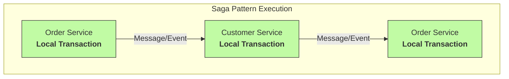
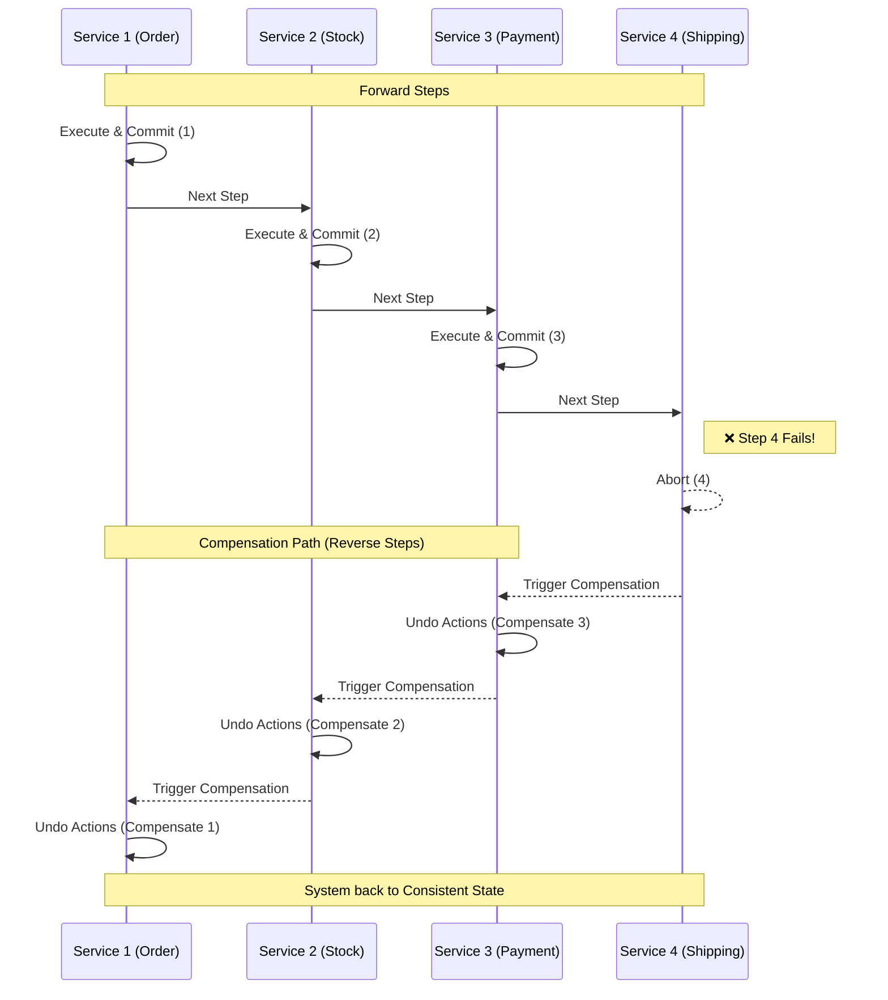
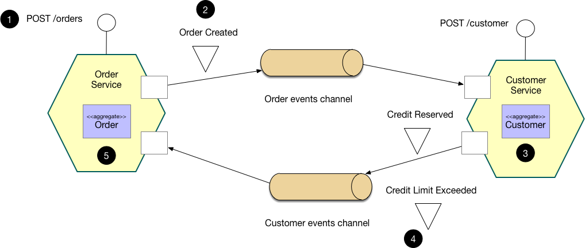
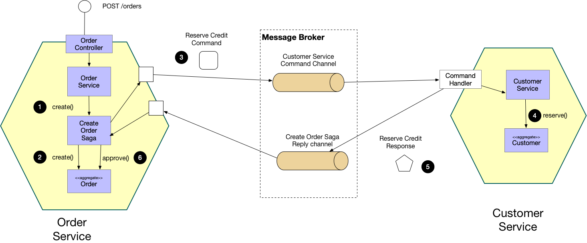
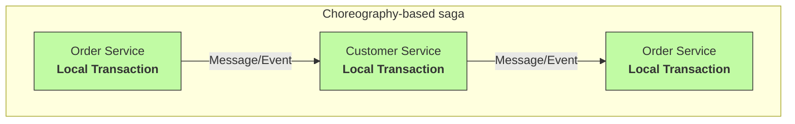
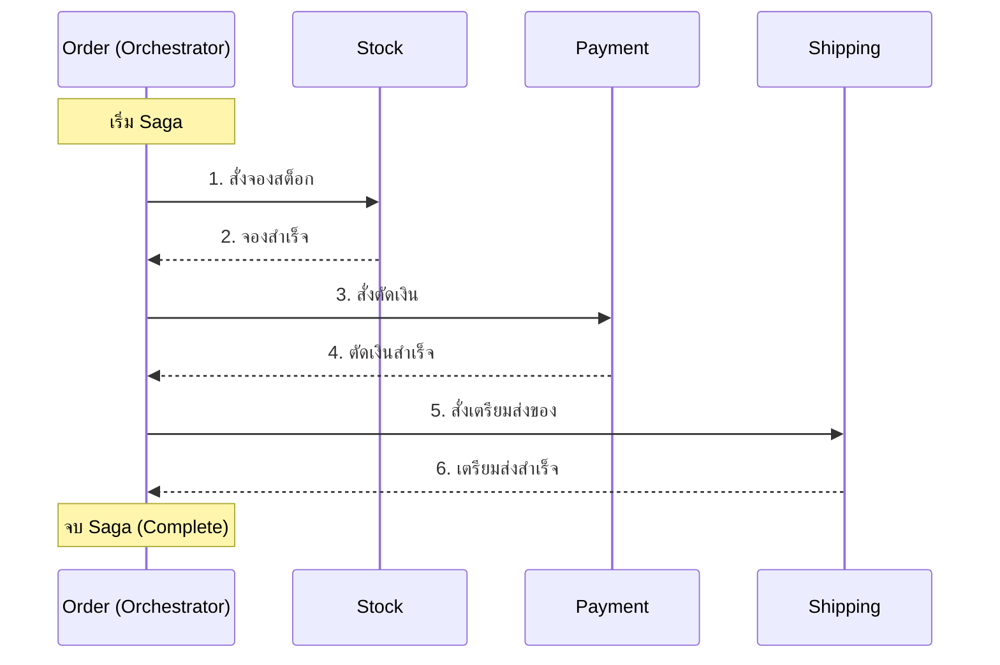

# การจัดการกับ Transaction ด้วย saga pattern

> เนื่องจาก Microservice แต่ละ Service มี Database เป็นของตนเอง การจัดการกับ Transaction จึงแตกต่างออกไปจาก Monolith อย่างมาก

## ก่อนมี saga Pattern
ก่อนมี saga Pattern นั้น การทำ Microservice ต้องจัดการ Transaction ด้วย `Distributed Transaction` ได้แก่ 2-Phase Commit (2PC) คือการที่ให้ทุกๆ Database ในระบบต้อง Commit ให้ครบ หากไม่ครบ จะ Rollback กลับทั้งหมด "All-or-Nothing"

> 2PC ทำให้เกิดความเป็น ACID (Atomicity, Consistency, Isolation, Durability)

แต่ปัญหาของวิธีการ 2PC ดังกล่าว คือ  **High coupling** หากมี Service ไหนตาย จะตายกันทั้งระบบ

ดังนั้นหากจะทำให้ไม่เกิดปัญหานี้เราจะต้องยอมให้แต่ละ Database commit เองไปเลยแล้วหากต้อง Rollback ก็ค่อยหาทางยกเลิกผลของ Commit ทั้งหมดที่เคย Commit ไป นี้แหละแนวคิดของ saga Pattern

## saga Pattern

### ลักษณะ

- แต่ละ Service มี Local Transaction และต่อกันเป็นลำดับของ Local Transaction
- ทุกครั้งที่แต่ละ Local Transaction นั้นมีการ Commit จะส่ง Asynchronous Message/Event ไปบอก Service ตัวถัดไปให้ทำงานต่อตนเอง
  - **ห้ามใช้ Synchronous (เช่น HTTP Rest หรือ gRPC) เด็ดขาดเลย** เพราะจะเกิด High Coupling
- SAGA ไม่มีการ Rollback แต่จะยกเลิกผลของการ Commit โดยการ `Compensating transactions` (การชดเชย) แทนที่การ Rollback
  - เช่น พอ Commit เงินเป็น 100 บาท แต่พอต้องทำ Compensating transactions ต้องโดน -100 บาทนั้นทิ้ง แทนการ Rollback เพราะ Commit ไปแล้ว

> **Important Note** 📝:
>
> - Compensating transactions ใช้ Undo การกระทำที่ commit ไปแล้วแทนที่การ Rollback

### ข้อดี
- Loose coupling หากมีคนตายไม่ตายทั้งระบบ

### ข้อเสีย
- ซับซ้อนวุ่นวายกว่า
- ใช้ Rollback ไม่ได้ ต้องคิด Logic ของ Compensating transactions

### ปัญหา
- ไม่ครบ ACID เพราะขาด Isolation ไป (แก้ได้ ✅)
  - เดี๋ยวคุยรายละเอียดในหัวข้อหลังๆ

## Compensating transactions
Compensating transactions ใช้ Undo การกระทำที่ commit ไปแล้วแทนที่การ Rollback เช่น โอนเงิน 100 บาท จะชดเชยโดยการถอนเงิน 100 บาทคืน เป็นต้น หากเกิด Failure ขึ้น ระบบจะไม่ส่ง Asynchronous  Message/Event ไปให้ SAGA ลำดับถัดไป แต่จะทำการชดเชย Local Transaction ตัวก่อนๆ เช่น

> SAGA pattern ที่มีลำดับ 1, 2, 3, **4(❌)**, 5, 6 หาก Failure ที่ 4 เราจะไม่ส่ง Message ไปบอก 5 ให้ทำงาน และจะทำการ Compensating transactions ชดเชยตัวก่อนๆ 

### ลำดับของการชดเชย

จากภาพจะเห็นว่าลำดับการทำงานของ SAGA คือ Order, Stock, Payment, Shipping แต่ที่ Shipping เกิดล้มเหลวขึ้นมา ลำดับการชดเชยจึงเป็น Payment, Stock, Order **เป็นลำดับย้อน (Reverse Order)**

> **Important Note** 📝:
>
> - Compensating transactions จะเป็นลำดับย้อน (Reverse Order) ของลำดับใน SAGA ก่อน Local Transaction ที่ล้มเหลว
>   - เช่น `1 commit`, `2 commit`, `3 commit`, `4 failure` จะมีลำดับชดเชยเป็น `3`, `2`, `1`

### บาง Transaction อาจจะไม่จำเป็นต้องเกิดการชดเชย
**บาง Transaction อาจจะไม่จำเป็นต้องเกิดการชดเชย** เช่น พวก Transaction ที่เป็น Read-Only 
- เช่น จากตารางจะเห็นได้ว่า `verifyConsumerDetails()` ไม่ต้อง Compensating transaction เพราะตัวเองเป็น Read-Only

| State       | Service            | Transaction             | Compensating transaction |
| :---------- | :----------------- | :---------------------- | :----------------------- |
| **Commit**  | Order Service      | createOrder()           | rejectOrder()            |
| **Commit**  | Consumer Service   | verifyConsumerDetails() | —                        |
| **Commit**  | Kitchen Service    | createTicket()          | rejectTicket()           |
| **Failure** | Accounting Service | authorizeCreditCard()   | —                        |
| **-**       | Kitchen Service    | ~~approveTicket()~~     | —                        |
| **-**       | Order Service      | ~~approveOrder()~~      | —                        |

## โครงสร้างของ saga

| Type                           | Service            | Transaction             |
| :----------------------------- | :----------------- | :---------------------- |
| **Compensatable transactions** | Order Service      | createOrder()           |
| **Compensatable transactions** | Consumer Service   | verifyConsumerDetails() |
| **Compensatable transactions** | Kitchen Service    | createTicket()          |
| **Pivot transactions**         | Accounting Service | authorizeCreditCard()   |
| **Retriable transactions**     | Kitchen Service    | approveTicket()         |
| **Retriable transactions**     | Order Service      | approveOrder()          |

- Compensatable transactions คือ Transactions ทียอมให้เกิด Compensating ได้
- Pivot transactions คือ Transactions ทีเป็นจุดตัดสินใจว่า saga นี้จะสำเร็จ หรือจะต้องไปทำ Compensating Transaction แทน
- Retriable transactions คือ Transactions ที่จะไม่ทำ Compensating แต่ถ้า Failure เกิดขึ้นที่นี้ต้อง **Retry** จนกว่าจะสำเร็จ

## Implementation ของ saga pattern

### ประเภทของ saga pattern
1. Choreography-based sagas (ไร้คนคุม)
2. Orchestration-based sagas (มีคนคุม)

### Choreography-based sagas


#### ลักษณะ
- ไม่มีใครคุมลำดับของ saga
  - Service พอทำ Local Transaction ของตนเองเสร็จจึง Message ไปบอก Service ตัวถัดไปเป็นทอดๆ โดยไม่มีใครคุมมัน

#### ข้อดี
- Loose coupling เพราะไม่มี Service ไหนรู้จักกันตรงๆ เลย
- ถ้าลำดับของ saga ไม่ยาวมาก `Choreography-based sagas` ตอบโจทย์

#### ข้อเสีย
- ซับซ้อนเพราะพอมีไม่คนคุมลำดับ saga ต้อง implement ให้แต่ Service รับมือเอง
  - code กำหนดลำดับของ saga ไม่ได้อยู่จุดเดียว กระจายตัวไปตามแต่ละ Service
- เข้าใจยากหาก saga มีลำดับยาว

### Orchestration-based sagas


#### ลักษณะ
- มีใครคุมลำดับของ saga
  - มี Service ที่สร้าง saga ขึ้นมาและเป็นคนคมลำดับของ saga โดยอันนี้จะแตกต่างจาก saga ปกตินิดนึง 

โดยปกติแล้ว saga จะทำงานแบบส่งต่อกันเป็นทอดๆ ตัวอย่างเช่น


แต่ใน Orchestration-based saga จะเปลี่ยนเป็นการที่ให้ Service (Orchestrator) หนึ่งควบคุม saga ไปเลย 

ส่วน Service อื่นๆ เมื่อก็รอให้ Orchestrator มาสั่งงานตนเอง



จากภาพจะเห็นว่าการสื่อสารจะกลับมาที่ Order (Orchestrator) ตลอด saga เลย

#### ข้อดี
- ถ้า saga มีลำดับยาวและซับซ้อน Orchestration-based saga จะตอบโจทย์กว่า
- Code ที่กำหนดลำดับของ saga อยู่ในที่เดียว

#### ข้อเสีย
- Orchestrator มี Business logic เยอะเกินไป
  - แก้ได้โดยแยกเป็นอีก Service ไปเลย เช่น `Order Service` แยกเป็น `Order Service` + `OrderOrchestrator` แทน
- Tight Coupling ที่ตรง Orchestrator เพราะต้องรู้จักทุกๆ Service

> **Important Note** 📝:
> 
> Orchestrator มี Business logic เยอะเกินไป สามารถแก้ได้โดยแยกเป็นอีก Service ไปเลย เช่น `Order Service` แยกเป็น `Order Service` + `OrderOrchestrator` แทน

### คำแนะนำ

> **Important Note** 📝:
>
> Chris Richardson (คนเขียน Microservices Patterns: With Examples in Java) แนะนำว่าให้ใช้ Orchestration-based sagas ทุกกรณี 
> 
> **ยกเว้นว่า saga แบบเรียบง่ายมากๆ** สามารถใช้ Choreography-based sagas แทนได้
>

- เทคโนโลยีและเครื่องมือยอดนิยมสำหรับ Orchestration Saga
  - Temporal.io
  - Camunda
  - AWS Step Functions 
  - ... เป็นต้น

## การรับมือกับการขาด Isolation ของ ACID ใน saga pattern
### ปัญหา
Isolation คือ กฏที่ช่วยให้ Transaction นั้นเกิด Consistency (ความถูกต้องของข้อมูล) แต่พอขาด Isolation ใน saga ไปแล้วอาจจะเกิดปัญหา **Lost Updates**, **Dirty Reads** ขอยกตัวอย่างเพื่อความเข้าใจง่ายขึ้น

***ตัวอย่างที่ 1 Lost Updates***
- saga A กำลังอัพเดต Order X
- saga B กำลังยกเลิก Order X และ Commit แล้ว
- saga A อัพเดต Order X เสร็จและ Commit แล้ว

แบบนี้มีสิทธิ์ที่การยกเลิกจะหายไปเลย

***ตัวอย่างที่ 2 Dirty Reads***
- นาย X มีเงิน 0 บาท
- saga A อัพเดตให้และ commit ทำให้นาย X มีเงิน 200 บาท แต่ยังไม่จบ saga A
- saga B อ่านเงินนาย X และเห็นว่ามีเงิน 200 บาท
- ต่อมา saga A เกิด Failure เลยทำการ Compensating transactions
  - ทำให้นาย X มีเงิน 0 บาท
- หากว่า saga B ยังไมจบ มันจะเอาค่าไปใช้แบบผิดๆ

### การแก้ปัญหา
#### Semantic lock
เพิ่ม state มาเป็น field พิเศษไว้บอก saga อื่นๆ ว่า record นั้นกำลังถูกใช้งานอยู่โดยใช้ `*_PENDING` เพื่อบอกว่ากำลังใช้งาน และค่อยตัด `_PENDING` ทิ้งเมื่อ saga ทำงานจนครบลำดับ เช่น
> Order table
> | id  | create_at  | ... | state            |
> | --- | ---------- | --- | ---------------- |
> | 1   | 2026-01-01 | ... | APPROVAL_PENDING |
> | 2   | 2026-01-01 | ... | REVISION_PENDING |
>
> เมื่อ saga ทำงานสำเร็จเราจะตัด `_PENDING` ทิ้งไป (ในที่นี้ Order Service ต้องอัพเดตดังนี้)
> 
> Order table
> | id  | create_at  | ... | state    |
> | --- | ---------- | --- | ---------|
> | 1   | 2026-01-01 | ... | APPROVAL |
> | 2   | 2026-01-01 | ... | REVISION |

##### เมื่อ saga อื่นๆ เจอ `*_PENDING`
มีได้ 2 กรณี
1. บอกให้ saga อื่นๆ ให้หยุด และ **Retry** ภายหลัง 
   - ทำง่ายสุด 
   - แต่ต้องให้ Service อื่นๆ มี Retry logic ด้วย
     - โค้ดจะเยอะมาก เพราะทุก Service ที่เกี่ยวข้องกับ saga เราจะต้องมี Retry logic
2. สั่ง saga อื่นๆ ให้รอ จนกว่าจะไม่ล็อค (ตัด `_PENDING` ทิ้งไปแล้ว)
   - ถ้าเขียนไม่ดี = อาจจะเจอ `Deadlock` คือทุกๆ saga ต่างรอกันหมด

#### Commutative updates (การอัพเดตมีสมบัติสลับที่)
ทำให้การอัพเดตได้ผลลัพธ์เหมือนเดิมแม้นจะเปลี่ยนลำดับ ขอทำให้เห็นภาพแบบ A + B = B + A อะไรเทือกนั้น 

> วิธีนี้แก้ Lost update ได้

ตัวอย่างเช่น

Account มี Transaction คือถอนเงิน `debit()`, ฝากเงิน `credit()` (ไม่รวมการเช็คจำนวนเงินก่อนถอนเงิน) ไม่ว่าจะทำลำดับใดก็ได้ผลลัพธ์ดังเดิมเช่น 100 - 10 + 20 = 100 + 20 - 10

```sql
-- Commutative updates
-- debit() 200 bath
UPDATE accounts 
SET balance = balance - 200 
WHERE account_id = 'A001';
```
แบบนี้ Compensating transactions จะเกิดตอนไหนก็ได้เพียงแค่ credit() 200 บาทคืนไป

เรามาดูแบบที่**ไม่เป็น Commutative updates** กันบ้าง
```sql
-- Non-commutative updates
-- debit() 200 bath
-- Current balance = 1000 -> 1000 - 200 = 800
UPDATE accounts SET balance = 800 WHERE account_id = 'A001';
```
แบบนี้ผลลัพธ์จะไม่เท่ากันหากสลับลำดับ เช่น saga A และ saga B เริ่มอ่าน Balance = 1000 พร้อมกัน ต่อมา saga A เปลี่ยนค่าเป็น 800 (ถอน 200 บาท) และ saga B เปลี่ยนค่าเป็น 700 (ถอน 300 บาท) ตามลำดับ ผลจะกลายเป็น Balance = 700 แต่ถ้าสลับ saga B, A ผลลัพธ์จะกลายเป็น 800 บาท แต่ผลลัพธ์ที่ถูกควรเป็น Balance = 500

#### Pessimistic View (มองโลกในแง่ร้าย)
เรียงลำดับของ saga ใหม่ให้ลดปัญหา **Dirty read** ให้มากที่สุด

Cancel Order Saga
- Consumer Service เพิ่มจำนวนยอดเงิน ***(Compensatable transactions)***
- Order Service เปลี่ยน state เป็น cancelled ***(Pivot transactions)***
- Delivery Service ยกเลิกการส่ง ***(Retriable transactions)***

> Delivery Service เป็นจุดเกิด Failure บ่อยๆ เช่น ไม่มีคนขับ

ทำไมแบบนี้จึงเกิด **Dirty read** ได้ง่าย เช่น เกิด Cancel Order Saga เพิ่มยอดเงินเป็น 200 บาทและ Create order saga อ่านค่า 200 บาทและลดจำนวนยอดเงินเป็น 150 บาท ต่อมา Cancel Order Saga เกิด Failure ที่ Delivery Service ยกเลิกการส่ง ทำให้เกิดการ Compensating transactions 

แต่ปัญหาคือ Create order saga อ่านค่า 200 บาทไปแล้ว

> Consumer Service จริงๆ มันไม่ควรเป็น Compensatable transactions เพราะหากถูกชดเชยจะทำให้คนอื่นเกิด **Dirty read**
>
> Delivery Service ควรเป็น Pivot transactions เพราะมันพังบ่อยๆ

**Pessimistic View** จะแก้ลำดับ saga ใหม่เป็น
- Order Service เปลี่ยน state เป็น cancelled ***(Compensatable transactions)***
- Delivery Service ยกเลิกการส่ง ***(Pivot transactions)***
- Consumer Service เพิ่มจำนวนยอดเงิน ***(Retriable transactions)***

สังเกตว่า Consumer Service เพิ่มจำนวนยอดเงินเป็น Retriable transactions หมายความว่า saga ต้อง retry ไปเรื่อยๆ จนกว่าจะเพิ่มจำนวนยอดเงินสำเร็จ

#### Reread value (อ่านซ้ำสองรอบ)
การอ่านอีกรอบจะทำให้มั่นใจว่าไม่มีการเปลี่ยนแปลงเกิดขึ้นระหว่าง saga นั้นๆ

> ป้องกัน Dirty read

#### Version File
ไม่ใช่ว่าทุกการอัพเดตจะเป็น Commutative ไม่ใช่ว่า A + B = B + A เสมอไป ถ้ามันไม่สามารถสลับที่ได้ เราจึงควรบันทึก Operation เพื่อให้เรียงลำดับใหม่ (Reorder) ใหม่ได้ดี 

เช่น ระบบนี้ไม่มี Semantic lock (ไม่มีเช็ค `*_PENDING`)

ถ้ามีสอง saga A ทำ cancel() กับ saga B approve() ผลลัพธ์ควรได้ cancel

- ถ้า saga B มาก่อน saga A ก็ดีไปได้ cancel 
- แต่ถ้า saga A มาก่อน saga B ผลดันได้ approve

หากทำ Version File ระบบจะบันทึกทุกๆ Operation และเห็นว่า saga A มาก่อนและจะข้าม saga B ทิ้งไป

#### By value (ตามมูลค่า/ความเสี่ยง)
ดูตามมูลค่าความเสี่ยง business risk
- ความเสี่ยงต่ำ ให้ใช้ Saga เพื่อความรวดเร็วและ Scalability
  - ประสิทธิภาพสูง แต่ปลอดภัยต่ำกว่า
- ความเสี่ยงสูง ให้ใช้ Distributed Transactions (เช่น 2PC)
  - ประสิทธิภาพต่ำ แต่ปลอดภัยสูงกว่า

