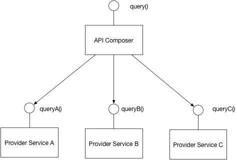
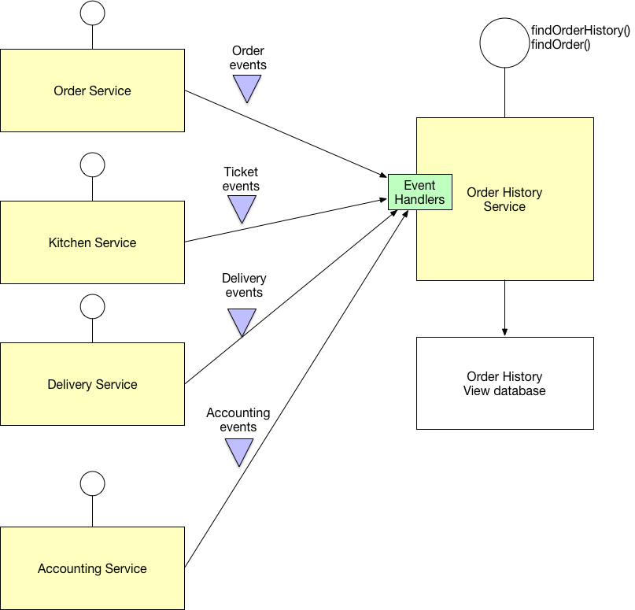
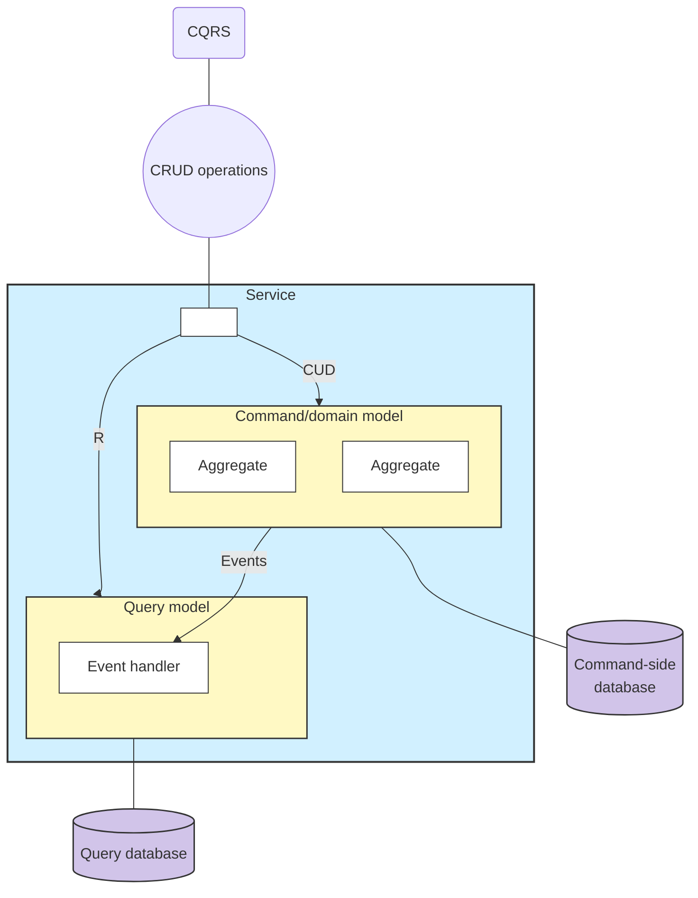
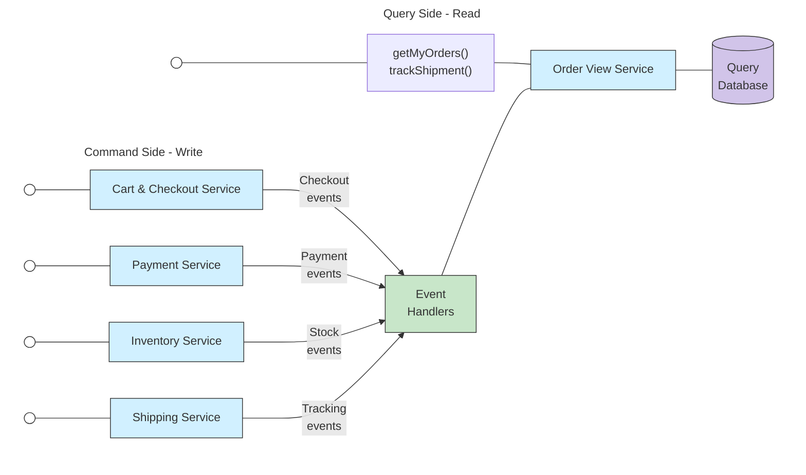

# การทำ Query ใน Microservice
> การ Query เพื่อขออ่านจากหลายๆ Databases เป็นเรื่องที่ท้าทายกว่า Monolith เพราะแต่ละ Service ใน Microservice นั้นต่างก็มี Database เป็นของตนเอง

## ประเภทของการทำ Query Microservice
แบ่งออกเป็น 2 รูปแบบ ได้แก่
1. API composition pattern (รูปแบบการประกอบ API)
2. Command query responsibility segregation (CQRS) pattern

## API composition pattern

### ลักษณะ
- `Provider service` เป็น Service ที่มี Database ให้บริการ
- `API composer` ทำหน้าที่เรียก Service ต่างๆ เพื่อ Query ข้อมูลออกมาจากแต่ละ Service ที่มี Database เป็นของตนเอง
  - ใครทำหน้าที่เป็น API composer ได้บ้าง
    - API Gateway ก็ได้
    - Backend for frontend (ทำเป็นอีก Service แยกสำหรับการ Query ก็ได้)
    - Frontend ก็ได้ แต่จะเปลืองเน็ตผู้ใช้เพราะต้องเรียก Service เองหลายๆ Request
  - ควรเรียก **Provider service** แบบขนานพร้อมกันให้ได้มากที่สุดเท่าที่จะเป็นไปได้

### ข้อดี
- ทำได้ง่ายกว่า CQRS มากๆ

### ข้อเสีย
- อาจจะมีประสิทธิภาพต่ำ
  - ลองคิดว่าเราต้อง **Join table** ขนาดใหญ่ๆ หลายๆตาราง กรณีนี้เราจะเปลือง Memory มากๆ
- อาจจะลด Availability เพราะทุกๆ Service ต้องทำงานพร้อมกัน
  - **ทางแก้:** หากมีบาง Service ล่ม ให้ส่งข้อมูลที่มีและไม่ต้องส่งข้อมูลที่ล่มให้ผู้ใช้และอย่าลืมบอกว่า Service ล่มด้วย
- มีสิทธิ์ที่จะได้ข้อมูลที่ Inconsistency (ไม่ถูกต้องสอดคล้อง)
  - **ทางแก้:** ต้องทำโค้ดตรวจจับอาการผิดปกติ เช่น อาจจะให้ API composer ส่ง Version Token ไปให้ผู้ใช้ทุกครั้ง โดย Version Token นี้ใช้เพื่อดูว่า Query ผู้ใช้เก่าแล้วหรือยัง?ดังนั้น API composer จะเช็คว่า Version Token ตรงกับเวอร์ชั้นล่าสุดไหม?

## Command query responsibility segregation (CQRS) pattern

### ทำไมต้องใช้ CQRS ?
- เพราะ API composition pattern ถ้าเกิดต้อง `Join table` ตารางขนาดใหญ่ ทำให้เปลือง Memory มากๆ
- Service ใช้ Database ที่ Query ไม่เก่ง
  - เช่น DynamoDB ไม่สามารถ Query อย่างอื่นนอกจาก Primary key ได้เลย
- **Separate concerns** การแยกการอ่านกับการเขียนเพราะเขียนความถี่น้อยกว่าอ่านมากๆ ทำให้แยกจะดีกว่า (จะได้ไม่ค้างทั้งระบบ)
  - เช่น การค้นหาสถานที่สักอย่างใกล้ฉัน (Geo-spatial Query) มันเป็นภาระที่หนักมากๆ ทีม dev จึงนิยมแยกมันไปอยู่อีก Service ไปเลย

### ลักษณะ
> Aggregate เราจะกล่าวกันต่อในบทหลังๆ

- เราจะแยก Database ของการอ่าน (Query-side) กับการเขียน (Command-side) ออกจากกัน โดยจะ Sync กันด้วยการส่ง Event เพื่อสื่อสารแลกเปลี่ยนข้อมูลให้ข้อมูลทั้งสองตรงกัน (Query-side จะ Copy ตาม Command-side)
  - Database เป็นคนละเทคโนโลยีกันได้
    - ข้อดี: ทำให้แก้ปัญหา Database ฝั่ง Command-side ไม่เก่ง Query ดังนั้น Database ฝั่ง Query-side สามารถเลือก Database ที่ Query เก่งๆ ได้
- เราจะแยกการเขียน (CUD) และการอ่าน (R) ออกจากกัน
  - Command-side จะทำหน้าที่รับคำสั่งเขียน (CUD) และจะส่ง Event (ผ่าน Message broker) ไปบอกว่าสร้างข้อมูลอะไรเพื่อ Sync ข้อมูลให้ตรงกัน
  - Query-side จะทำหน้าที่รับคำสั่งอ่าน (R) และจะมี Event handler ไว้รับข้อมูลการสร้างข้อมูลจากฝั่ง Command-side เพื่อ Sync ข้อมูลให้ตรงกัน
- ฝั่ง Query-side ต้องอยู่ใน Service ไหน แยกเป็นอีก Service พิเศษดีไหม?
  - คำตอบ แน่นอนแยกเป็นอีก Service ดีที่สุด เช่น

- จากรูปเราแยก Service สำหรับ Query ออกมาเป็น Service พิเศษ (จากรูปคือ Order View Service) และให้มันแลกเปลี่ยนข้อมูลกับ Service ที่มี Database ที่ต้องการ (จากรูปคือ Cart & Checkout Service, Payment Service, Inventory Service และ Shipping Service)

### ข้อดี
- ประสิทธิภาพของการ Query สูงกว่า
- แยกการเขียนและการอ่านออกจากกันชัดเจน (Separate concerns) 
  - ดีกับระบบที่อ่านเยอะกว่าเขียนมากๆ

### ข้อเสีย
- มีความซับซ้อนสูงมาก
- อาจจะมี Lag ของ Command-side กับ Query-side ทำให้เกิด Inconsistency ของข้อมูล
  - แก้ได้

### คำแนะนำ

> **Important Note** 📝:
>
> เราควรใช้ API composition pattern เป็นตัวเลือกแรก และใช้ CQRS เมื่อจำเป็นเท่านั้น เช่น
> - Database ของ Service ที่สนใจมี Query ที่ไม่เก่ง
> - ภาระการอ่านเยอะกว่าเขียนมากๆ
> - ต้อง Join table ขนาดใหญ่ ทำให้ Memory ใช้เยอะ

### การ Implement ของ CQRS
#### การเลือก Database ของฝั่ง Query
- อยากอ่านไวที่สุด ไม่สนความสัมพันธ์ = NoSQL (Document Store)
- อยาก Search ชื่อสินค้า/บทความ เก่งๆ = Search Engine (Elasticsearch)
- อยากทำ Dashboard/Report ซับซ้อน = SQL (RDBMS)
- ไม่แน่ใจ แต่อยากได้ความยืดหยุ่น = SQL (PostgreSQL)

#### ป้องกัน Duplicated messages
- มีตารางไว้จด Event ที่เคย Process ไปแล้ว `PROCESSED_EVENTS` เพื่อป้องกันการซ้ำการส่งของ Message Broker

#### ป้องกัน Inconsistency
- ใช้ Version token เพื่อเช็คว่า Query ของผู้ใช้เก่าไปแล้วหรือไม่ เพราะเมื่อมีการอัพเดต database ตลอดมีโอกาสที่ผู้ใช้จะมี Query ที่ยังไม่อัพเดต

#### ป้องกัน Concurrency ใน Record เดียวกัน
- ใช้ Pessimistic locking เช่น `SELECT ... FOR UPDATE;`
- ใช้ Optimistic locking เช็คว่า Version ตรงกับปัจจุบันหากไม่ตรงแสดงว่ามีคนเขียนก่อนเรา เช่น `WHERE version = current_version`

